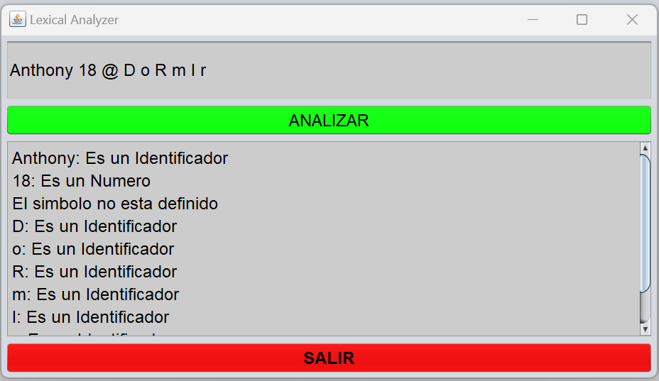

# Flex_Lexical_Analyzer
## Actividad: Crear un analizador Léxico en FLEX

1. Crear un analizador Léxico en el Lenguaje de programación de su preferencia, pero utilizando FLEX.
  * Netbeans 8.2
  * Java JDK 8 2.
2. Documentar Lenguaje utilizado del analizador Léxico para realizar pruebas.
  ```java
  package codigo;
  import static codigo.Tokens.*;
  %% /*Declaraciones que vamos a utilizar*/
  %class Lexer
  %type Tokens
  L=[a-zA-z_]+
  D=[0-9]+
  espacio=[ ,\t,\r,\n]+ /*Los espacios que ignorara el analizador lexico*/
  %{
    public String lexeme;
  %}
  %%
  /*Palabras reservadas*/
  int |
  if |
  else |
  while {lexeme=yytext(); return Reservadas;}
  {espacio} {/*Ignore*/} /*Se ignoraran los espacios*/
  "//".* {/*Ignore*/}
  "=" {return Igual;}
  "+" {return Suma;}
  "-" {return Resta;}
  "*" {return Multiplicacion;}
  "/" {return Division;}
  {L}({L}|{D})* {lexeme=yytext(); return Identificador;}
  ("(-"{D}+")")|{D}+ {lexeme=yytext(); return Numero;}
  . {return ERROR;}
```
3. Imagen de portada.

  
